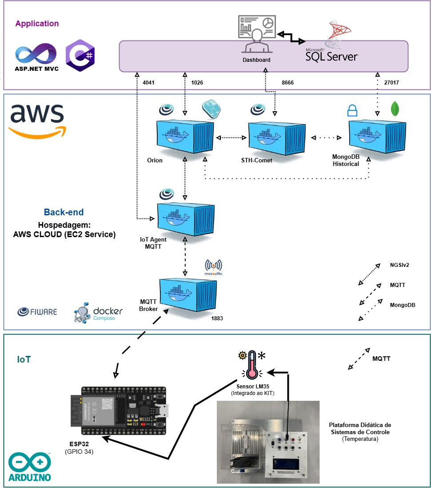

# 🔧 CoolerCopper – Inovação em Secagem de Motores Elétricos

## 🧠 Quem Somos

A **CoolerCopper** é um projeto acadêmico interdisciplinar com foco no desenvolvimento de soluções inteligentes para o **monitoramento térmico de estufas de secagem de motores elétricos**. Utilizando tecnologias baseadas em **Internet das Coisas (IoT)** e **sistemas embarcados**, propomos uma solução eficiente, acessível e de fácil implementação.

Nosso objetivo é elevar o padrão do processo de secagem industrial, garantindo **uniformidade térmica, confiabilidade dos dados** e **controle em tempo real**.

---

## 👨‍💻 Equipe

| Integrante                     | RA         |
|-------------------------------|------------|
| Rafael Rupert Barrocal        | 081230002  |
| Matheus da Silva Souza        | 081230011  |
| Henrique Alves Ferreira       | 081230015  |
| Pedro Henrique Simões Reys    | 081230022  |
| Gabriel Melo Santos           | 081230044  |

---

## 🎯 Objetivo do Projeto

Desenvolver um **sistema de monitoramento térmico IoT** para estufas utilizadas na secagem de motores elétricos, com os seguintes objetivos:

- Obter dados de temperatura em tempo real.
- Garantir eficiência operacional e controle de qualidade no processo de secagem.
- Utilizar sensores conectados a um microcontrolador ESP32.
- Utilizar a plataforma **FIWARE** como back-end em nuvem.
- Criar uma aplicação web com **ASP.NET Core MVC**, exibindo dashboards, relatórios e telas de gerenciamento.

---

## 🧩 Arquitetura do Sistema

**Componentes Principais:**

- **Camada IoT:** Dispositivos com sensores conectados via ESP32 utilizando MQTT.
- **Back-end (FIWARE):** Gerenciamento do contexto e histórico via Orion Context Broker e STH-Comet, hospedado em servidor Linux (AWS) com Docker.
- **Aplicação Web:** ASP.NET Core MVC, com persistência em SQL Server, consumo de APIs, controle de acesso e interface de consulta e visualização dos dados.

---

## 💡 Diferenciais

- ✅ Arquitetura modular e escalável.
- 📡 Monitoramento térmico em tempo real.
- 🔐 Sistema com autenticação e controle de usuários.
- 📈 Dashboards intuitivos e filtros para análises históricas.
- ⚙️ Fácil integração com sistemas industriais existentes.
- 💰 Foco em custo-benefício com alto desempenho técnico.

---

## 🛠️ Tecnologias Utilizadas

| Tecnologia            | Finalidade                                       |
|------------------------|--------------------------------------------------|
| **C# / ASP.NET Core**  | Lógica de negócio e interface web               |
| **SQL Server**         | Persistência de dados relacionais               |
| **ESP32 (Wi-Fi)**      | Coleta de dados dos sensores                    |
| **MQTT**               | Protocolo leve de comunicação IoT              |
| **FIWARE (Orion/Comet)** | Backend IoT, gerenciamento e histórico de contexto |
| **Docker + AWS**       | Hospedagem em nuvem do ambiente FIWARE         |
| **HTML5 / CSS / JS / AJAX** | Front-end responsivo e interativo         |
| **JSON / NGSI v2**     | Formato e padrão de troca de dados              |

---

## 🚀 Funcionalidades

- 🌡️ Monitoramento contínuo da temperatura no processo de secagem.
- 🔄 Integração entre sensores IoT (ESP32) e APIs do FIWARE.
- 📁 Sistema Web com:
  - CRUDs (3), incluindo relacionamento entre tabelas e imagens.
  - Tela de login e controle de sessão por perfil de usuário.
  - Tela "Sobre" com informações do projeto e dos autores.
  - Filtros e consultas a dados em tempo real (via API FIWARE).
- 📊 Dashboards dinâmicos com histórico e estatísticas.
- 📉 Aplicação de **modelo de regressão linear** para análise térmica.
- 🧪 Testes experimentais com análise de resposta em malha aberta e fechada.

---
## ⚙️ Sistemas Embarcados (ESP32, AWS, Docker e FIWARE)

### 📶 ESP32: Microcontrolador IoT

O **ESP32** é um microcontrolador com Wi-Fi integrado, ideal para aplicações de IoT. No projeto, ele é responsável por:

- Realizar a **leitura dos sensores de temperatura** da estufa.
- Enviar os dados por **protocolo MQTT** para o servidor FIWARE.
- Operar de forma autônoma e em tempo real com baixo consumo de energia.

---

### ☁️ AWS: Infraestrutura em Nuvem

A plataforma **Amazon Web Services (AWS)** foi utilizada para hospedar o ambiente FIWARE em uma **instância EC2 Linux**, garantindo:

- **Alta disponibilidade** do sistema.
- Acesso remoto aos dados de qualquer local.
- Facilidade de escalabilidade e manutenção.

---

### 📦 Docker: Contêineres para Implantação

**Docker** foi utilizado para containerizar os serviços do FIWARE, como:

- Orion Context Broker
- STH-Comet
- MongoDB
- IoT Agent (opcional)

Isso garante:

- Implantação padronizada e reprodutível.
- Facilidade na configuração e atualização dos serviços.
- Ambiente isolado e controlado.

---

### 🌐 FIWARE: Plataforma Open Source para IoT

**FIWARE** é responsável pelo gerenciamento de contexto da aplicação IoT. No projeto, os seguintes componentes foram utilizados:

| Componente             | Função                                                                 |
|------------------------|------------------------------------------------------------------------|
| Orion Context Broker   | Gerencia os dados de temperatura recebidos em tempo real               |
| STH-Comet              | Armazena os dados históricos em MongoDB                                |
| NGSI (JSON)            | Protocolo de comunicação entre os componentes FIWARE                   |

## 📚 Disciplinas Envolvidas

| Disciplina                | Contribuições Técnicas                                                             |
|---------------------------|------------------------------------------------------------------------------------|
| **Sistemas Embarcados**   | Integração ESP32, sensores, MQTT, Docker, FIWARE, MongoDB                         |
| **Fenômenos dos Transportes** | Cálculo do coeficiente global de transferência de calor e simulações térmicas |
| **Automação e Controle**  | Modelagem matemática, transformadas de Laplace, controle PID, análise em malhas   |
| **Linguagem de Programação I** | Desenvolvimento Web em ASP.NET Core MVC com API, AJAX, SQL e boas práticas  |
| **Mecânica dos Sólidos**  | Gestão de projeto e análise estatística via regressão linear                      |

---

## 📈 Resultados Esperados

- ✔️ Monitoramento térmico eficiente e automatizado.
- ✔️ Aumento da confiabilidade e da uniformidade no processo de secagem.
- ✔️ Análises comparativas em tempo real e baseadas em histórico.
- ✔️ Integração entre teoria (controle, transferência de calor, programação) e prática aplicada.

---

---

> Projeto desenvolvido no contexto do **Project Based Learning (PBL)** do curso de **Engenharia da Computação** – 2025.

